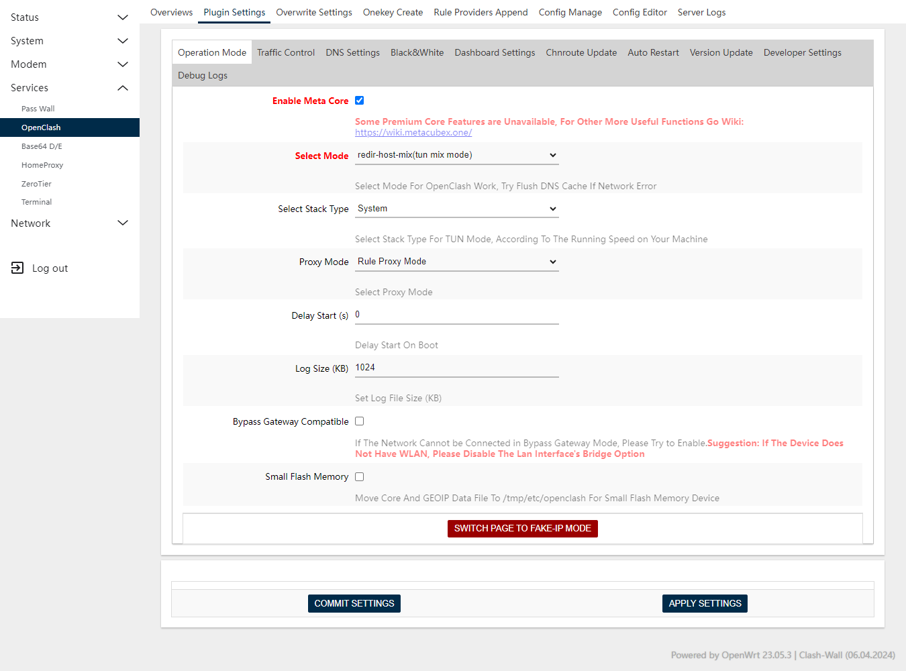

# OISD Rule Providers for Clash

This repository contains a set of scripts to generate Clash rule providers for the [OISD blocklist](https://oisd.nl/). The OISD blocklist is a list of domains that are known to be used for serving ads, tracking, and malware. The currently available rules can be [found here](https://github.com/ikram-maulana/oisd-clash-rule/tree/main/rule_provider).

## Usage

- Open your `config.yaml` file on your Clash configuration directory.

- Add the following configuration to your `config.yaml` file:

  ```yaml
  rule-providers:
    Blocklist_Ads_D3ward:
      type: http
      behavior: classical
      path: './rule_provider/Blocklist_Ads_D3ward.yaml'
      url: https://raw.githubusercontent.com/ikram-maulana/oisd-clash-rule/main/rule_provider/Blocklist_Ads_D3ward.yaml
      interval: 86400 # Update rules every 24 hours
    Blocklist_Ads:
      type: http
      behavior: classical
      path: './rule_provider/Blocklist_Ads.yaml'
      url: https://raw.githubusercontent.com/ikram-maulana/oisd-clash-rule/main/rule_provider/Blocklist_Ads.yaml
      interval: 86400 # Update rules every 24 hours
    Blocklist_NSFW:
      type: http
      behavior: classical
      path: './rule_provider/Blocklist_NSFW.yaml'
      url: https://raw.githubusercontent.com/ikram-maulana/oisd-clash-rule/main/rule_provider/Blocklist_NSFW.yaml
      interval: 86400 # Update rules every 24 hours
  rules:
    # Rules before match global
    - RULE-SET,Blocklist_Ads_D3ward,REJECT
    - RULE-SET,Blocklist_Ads,REJECT
    - RULE-SET,Blocklist_NSFW,REJECT
    # Listen all connections to GLOBAL proxy
    - MATCH,GLOBAL
  ```

- Open `OpenClash -> Plugin Settings -> Operation Mode`, and set the value like image below:

  

- Restart your Clash instance.
