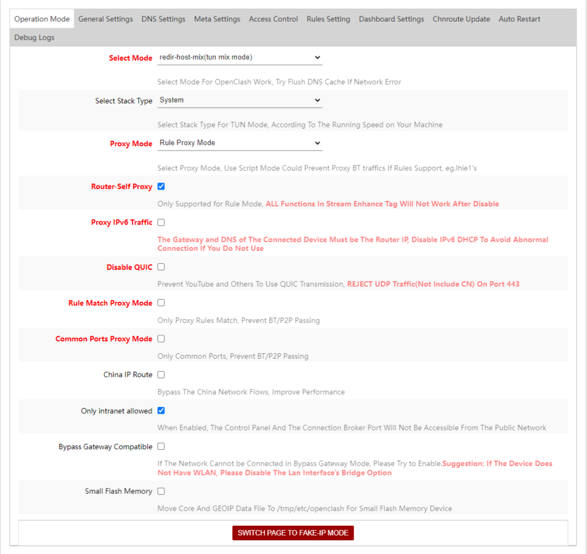

# Blocklist Rule Providers for Clash

This repository contains a set of scripts to generate Clash rule providers. The rules are generated from various blocklist sources. Used to split the traffic connection based on the blocklist category.

## Available Rule Providers

- [Blocklist_Ads_D3ward](https://raw.githubusercontent.com/ikram-maulana/oisd-clash-rule/main/rule_provider/Blocklist_Ads_D3ward.yaml)
- [Blocklist_Ads_OISD](https://raw.githubusercontent.com/ikram-maulana/oisd-clash-rule/main/rule_provider/Blocklist_Ads.yaml)
- [Blocklist_NSFW](https://raw.githubusercontent.com/ikram-maulana/oisd-clash-rule/main/rule_provider/Blocklist_NSFW.yaml)
- [Blocklist_Ads_Indo](https://raw.githubusercontent.com/ikram-maulana/oisd-clash-rule/main/rule_provider/Blocklist_Ads_Indo.yaml)
- [Blocklist_Ads_MultiPro](https://raw.githubusercontent.com/ikram-maulana/oisd-clash-rule/main/rule_provider/Blocklist_Ads_MultiPro.yaml)
- [Blocklist_DohVpnProxyBypass](https://raw.githubusercontent.com/ikram-maulana/oisd-clash-rule/main/rule_provider/Blocklist_DohVpnProxyBypass.yaml)
- [Blocklist_Native_Apple](https://raw.githubusercontent.com/ikram-maulana/oisd-clash-rule/main/rule_provider/Blocklist_Native_Apple.yaml)
- [Blocklist_Native_OppoRealme](https://raw.githubusercontent.com/ikram-maulana/oisd-clash-rule/main/rule_provider/Blocklist_Native_OppoRealme.yaml)
- [Blocklist_Native_TikTok_Extended](https://raw.githubusercontent.com/ikram-maulana/oisd-clash-rule/main/rule_provider/Blocklist_Native_TikTok_Extended.yaml)
- [Blocklist_Native_TikTok](https://raw.githubusercontent.com/ikram-maulana/oisd-clash-rule/main/rule_provider/Blocklist_Native_TikTok.yaml)
- [Blocklist_Native_Vivo](https://raw.githubusercontent.com/ikram-maulana/oisd-clash-rule/main/rule_provider/Blocklist_Native_Vivo.yaml)
- [Blocklist_Native_WinOffice](https://raw.githubusercontent.com/ikram-maulana/oisd-clash-rule/main/rule_provider/Blocklist_Native_WinOffice.yaml)
- [Blocklist_Native_Xiaomi](https://raw.githubusercontent.com/ikram-maulana/oisd-clash-rule/main/rule_provider/Blocklist_Native_Xiaomi.yaml)
- [Blocklist_NoSafeSearch](https://raw.githubusercontent.com/ikram-maulana/oisd-clash-rule/main/rule_provider/Blocklist_NoSafeSearch.yaml)
- [Blocklist_Threat_Medium](https://raw.githubusercontent.com/ikram-maulana/oisd-clash-rule/main/rule_provider/Blocklist_Threat_Medium.yaml)
- [Blocklist_WindowsSpy](https://raw.githubusercontent.com/ikram-maulana/oisd-clash-rule/main/rule_provider/Blocklist_WindowsSpy.yaml)

## Usage

- Open your `config.yaml` file on your Clash configuration directory.

- Add the following configuration to your `config.yaml` file like the example below:

  ```yaml
  rule-providers:
    Blocklist_Ads_D3ward:
      type: http
      behavior: classical
      path: './rule_provider/Blocklist_Ads_D3ward.yaml'
      url: https://raw.githubusercontent.com/ikram-maulana/oisd-clash-rule/main/rule_provider/Blocklist_Ads_D3ward.yaml
      interval: 86400 # Update rules every 24 hours
    Blocklist_Ads_OISD:
      type: http
      behavior: classical
      path: './rule_provider/Blocklist_Ads.yaml'
      url: https://raw.githubusercontent.com/ikram-maulana/oisd-clash-rule/main/rule_provider/Blocklist_Ads.yaml
      interval: 86400 # Update rules every 24 hours
    Blocklist_NSFW:
      type: http
      behavior: classical
      path: './rule_provider/Blocklist_NSFW.yaml'
      url: https://raw.githubusercontent.com/ikram-maulana/oisd-clash-rule/main/rule_provider/Blocklist_NSFW.yaml
      interval: 86400 # Update rules every 24 hours
  rules:
    # Rules before match global
    - RULE-SET,Blocklist_Ads_D3ward,REJECT
    - RULE-SET,Blocklist_Ads,REJECT
    - RULE-SET,Blocklist_NSFW,REJECT
    # Listen all connections to GLOBAL proxy
    - MATCH,GLOBAL
  ```

- Open `OpenClash -> Plugin Settings -> Operation Mode` or `OpenClash -> Global Settings -> Operation Mode`, and set the value like image below:

  

- Restart your Clash instance.

## FAQ

### Can I request a new rule provider?

Yes, you can create an issue on this repository to request a new rule provider.

### How to contribute?

You can create a pull request to add a new rule provider or update the existing rule provider.

### How to update the rule provider?

You can update the rule provider by changing the `interval` value on the rule provider configuration. On OpenClash STB, the rule provider will not be updated automatically. You need to update it manually by clicking the `Update` button on the rule provider configuration.

## Resources

- [ABPindo](https://github.com/ABPindo/indonesianadblockrules)
- [CrazyMax](https://github.com/crazy-max/WindowsSpyBlocker)
- [D3ward](https://github.com/d3ward/toolz)
- [Hagezi](https://github.com/hagezi/dns-blocklists)
- [OISD](https://oisd.nl/)
